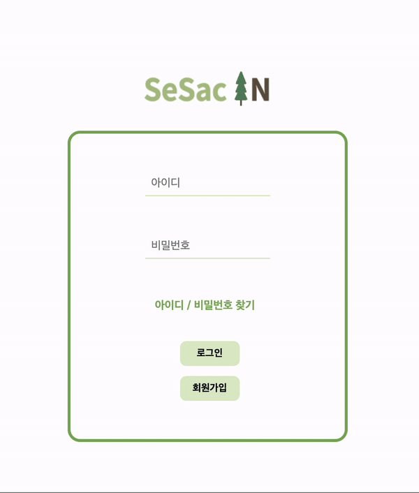
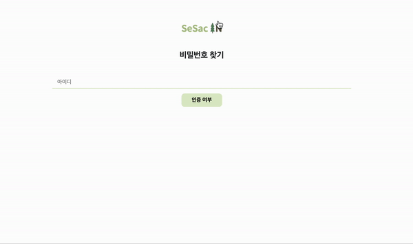

# SesacIn (Sesac + 지식in)

<center></center>
새싹 캠퍼스 학생들을 위한 SesacIn 커뮤니티 프로젝트입니다.

&nbsp;

🖥️ 프로젝트 소개
--

&nbsp;
새싹인들을 위한 지식 공유 커뮤니티입니다.

<a link="https://sesacin.online/">새싹인 서비스 바로가기
&nbsp;

🕰️ 개발 기간
--
23.09.06일 - 23.09.22일

&nbsp;

## 시작 가이드
### Requirements
For building and running the application you need:

- [Node.js 20.7.0](https://www.npmjs.com/package/node/v/20.7.0)
- [Npm 10.2.0](https://www.npmjs.com/package/npm/v/10.2.0)


### Installation
``` bash
$ git clone https://github.com/SesacProjectTeamC/SesacIn.git
```

```
$ npm i
$ npm start
```


### 🧑‍🤝‍🧑 팀 구성

| 프론트 개발 | 프론트 개발 | 백엔드 개발 | 백엔드 개발 |백엔드 개발 |
|---|---|---|---|---|
|  |  | |  | 
| <a link="https://github.com/Sangwoo97">@sangwoo | <a link="https://github.com/ellin45">@chaelim | <a link="https://github.com/loveflora">@sehwa | <a link="https://github.com/hotdog7778">@taegyun | <a link="https://github.com/jinnymoon1124">@hyojin
| 김상우 | 정채림 | 김세화 | 김태균 | 문효진    


| 이름    | 담당 역할                                      |
|-------|------------------------------------------------|
| 김상우 | 메인 페이지 및 게시판 작성 및 상세 페이지 구현     |
| 정채림 | 사용자 관련 페이지 구현, 마이페이지 게시글 분류 정리|
| 김세화 | 질문 게시판 관련 API 개발, 좋아요 및 조회수 기능 개발|
| 김태균 | 자유 게시판 관련 API 개발, 페이지네이션 기능, 미들웨어 처리|
| 문효진 | 사용자 관련 API 개발, 이메일 인증 및 유효성 검사    |


&nbsp;

### ⚙️ 개발 환경

**[FE]**
   
 
**[BE]** 	


**[DB]** 	 


 **[SERVER]**
 	

**[COMMUNITY]**


&nbsp;


📌 주요 기능
--

|----------|--------| 
| 로그인 | 회원가입 |
|| |
|Q&A 게시판 , 자유 게시판 글 작성|아이디찾기 |비밀번호 찾기|
|||
|
|Q&A 게시판질문에 대한 답변 작성,답변에 대한 댓글 작성|자유게시판 글에 댓글 작성 및 수정|
|||
|내가 작성한 Q&A 게시판 글 조회 | 내가 작성한 Q&A 게시판 글 조회|
|![register]|![register]|
|내가 선택한 좋아요 글 조회 | 내가 작성한 댓글 조회|
|![register]|![register]|


사용 가이드


- ID 및 닉네임 중복 체크
- 닉네임 비속어 필터
- 유효성 검사
 
&nbsp;

로그인

- DB 값 검증
- ID 찾기
- 비밀번호 재설정  
    - 이메일 인증 여부에 따라 동작 
- 로그인 시 세션( Session ) 생성
 
&nbsp;

메인페이지

- 로그인 여부에 따라 헤더 변경
- 캐러셀 링크 연동
- 게시판 별 최근 20개의 글 스와이퍼 형식으로 제공
- 각 게시글에 대한 좋아요, 조회수, 댓글 수 확인
 
&nbsp;

Q&A 게시판

- CRUD
- 질문 유형별 태그 선택
- 질문에 대한 답변 작성
    - 답변에 대한 댓글 작성 
- 좋아요 및 조회수 확인
 
&nbsp;

자유 게시판 

- CRUD
- 댓글 작성
- 좋아요 및 조회수 확인
 
&nbsp;

마이페이지

- 프로필 사진 변경
- 활동 기록 조회 기능
    - 작성한 게시글 ( QnA / 자유 )
    - 댓글 작성한 게시글
    - 좋아요 누른 게시글
 
&nbsp;

회원 정보 수정

- 닉네임 중복 검사
- 비속어 필터
- 유효성 검사
- 회원 탈퇴


## 디렉토리 구조

```bash
├── README.md
├── api.http
├── app.js
├── config
│   ├── config.json
│   └── email.js
├── controller
│   ├── Canswer.js
│   ├── Cboard.js
│   ├── Ccomment.js
│   ├── Cmain.js
│   ├── Cprofile.js
│   ├── Cquestion.js
│   ├── Cupload.js
│   └── Cuser.js
├── middlewares
│   ├── badWordsFilter
│   │   └── badWordsFilter.js
│   ├── multer
│   │   └── multerConfig.js
│   ├── needToLogin.js
│   ├── session
│   │   └── session.js
│   └── swagger
│       ├── swagger.js
│       └── swaggerDefinition.json
├── models
│   ├── Answer.js
│   ├── Board.js
│   ├── Comment.js
│   ├── Like.js
│   ├── Question.js
│   ├── User.js
│   └── index.js
├── routes
│   ├── boardRouter.js
│   ├── index.js
│   ├── profileRouterToBeDelete.js
│   ├── questionRouter.js
│   ├── uploadRouter.js
│   └── usersRouter.js
├── static
│   ├── editor
│   │   ├── ckeditor.js
│   │   └── editorStyle.css
│   ├── editorImg
│   ├── img
│   ├── js
│   │   ├── boardDetail.js
│   │   ├── edit.js
│   │   ├── index.js
│   │   ├── listMain.js
│   │   ├── main.js
│   │   ├── post.js
│   │   ├── profile.js
│   │   └── questionDetail.js
│   ├── profileImg
│   └── svg
└── views
    ├── 404.ejs
    ├── community
    │   ├── boardDetail.ejs
    │   ├── edit.ejs
    │   ├── listMain.ejs
    │   ├── post.ejs
    │   └── questionDetail.ejs
    ├── components
    │   ├── carousel.ejs
    │   ├── cdn.ejs
    │   ├── footer.ejs
    │   ├── freeBoardCard.ejs
    │   ├── header.ejs
    │   └── questionBoardCard.ejs
    ├── main.ejs
    ├── styles
    │   ├── boardDetail.css
    │   ├── editProfile.css
    │   ├── email.css
    │   ├── findId.css
    │   ├── findPw.css
    │   ├── globalstyle.css
    │   ├── index.css
    │   ├── listMain.css
    │   ├── login.css
    │   ├── post.css
    │   ├── profile.css
    │   └── register.css
    └── user
        ├── editprofile.ejs
        ├── email.ejs
        ├── findId.ejs
        ├── findPw.ejs
        ├── join.ejs
        ├── login.ejs
        └── profile.ejs

```